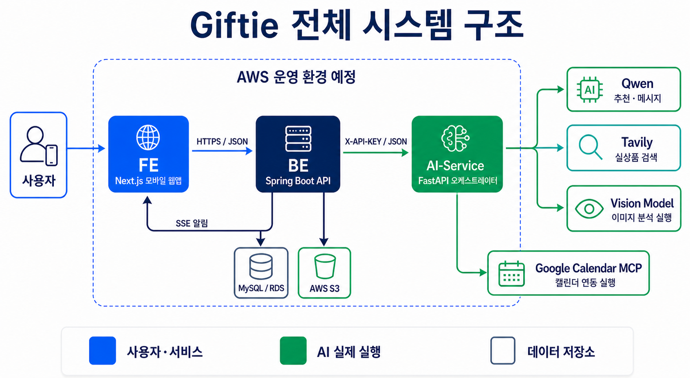

# Giftie

> 받은 마음을 잊지 않고, 적절한 답례까지 이어 주는 AI 인간관계 관리 에이전트

Giftie는 생일선물, 감사 선물, 부조금처럼 사람 사이에서 주고받은 마음을 기록하고
답례할 시점과 선물을 추천하며 캘린더와 알림 준비까지 자동화하는 모바일 중심
웹 서비스입니다. 단순히 “무엇을 선물할까요?”라고 조언하는 데서 끝나지 않고
기록·일정·알림·추천에 필요한 데이터를 한 번의 입력으로 준비하는 것을 목표로 합니다.

## 문서 바로가기

- [프론트엔드 상세 문서](FE_Readme.md)
- [백엔드 상세 문서](BE_Readme.md)
- [AI Service 상세 문서](AI_Service_Readme.md)
- 실제 소스 폴더: `../FE`, `../BE`, `../AI-Service`

## 1. 해커톤 주제

### AI 에이전트가 나 대신 한다

Giftie는 사용자가 받은 선물 정보를 입력하거나 캡처 이미지를 전달하면 다음 작업을
한 번에 준비합니다.

1. 받은 마음 기록 데이터 생성
2. 답례 일정 데이터 생성
3. 알림 예약 데이터 생성
4. 받은 선물과 상대방을 고려한 답례 선물 및 감사 메시지 추천
5. 실제 구매 가능한 상품 검색

사용자가 여러 화면에서 내용을 다시 입력하는 공수를 줄이고 “받은 마음을 기억해서
적절한 시점에 돌려주는 일”을 AI 에이전트가 실행 가능한 데이터로 바꾸는 서비스입니다.

## 2. 문제 정의

### 해결하려는 문제

선물과 부조금은 금액만의 문제가 아니라 관계의 맥락을 포함합니다. 하지만 시간이
지나면 누가, 언제, 어떤 이유로, 무엇을 주었는지 기억하기 어렵습니다. 기록을 놓치면
답례 시점도 놓치고 무엇을 어느 가격대로 돌려줘야 하는지 다시 고민해야 합니다.

### 대상 사용자

- 받은 선물이나 부조금을 자주 잊는 사람
- 생일·결혼·출산·경조사 등 관계 일정이 많은 사람
- 답례 가격과 품목을 고르는 데 부담을 느끼는 사람
- 여러 사람의 선물 이력을 캘린더와 함께 관리하고 싶은 사람

### 왜 중요한가

- 답례 누락으로 생기는 관계의 서운함을 줄입니다.
- 기억과 검색에 쓰는 시간을 줄입니다.
- 상대방과 받은 선물의 맥락을 반영해 과하거나 부족하지 않은 답례를 돕습니다.
- 기록, 일정, 알림, 추천이 분리된 문제를 하나의 흐름으로 연결합니다.

## 3. 서비스 한 줄 정의

선물을 받아 놓고 자주 잊는 사용자를 위해 받은 마음을 기록하고 적절한 답례 시점과
실제 선물을 찾아 일정과 알림까지 준비해 주는 AI 인간관계 관리 서비스입니다.

## 4. 핵심 사용자 흐름

### 직접 입력

1. 사용자가 선물명, 가격, 상대방, 관계, 받은 날짜 등을 입력합니다.
2. 백엔드가 입력을 검증하고 AI Service에 전달합니다.
3. AI Service가 기록·캘린더·알림·추천 작업을 병렬로 실행합니다.
4. 백엔드가 결과를 저장하고 프론트에 반환합니다.
5. 사용자는 사람별 목록, 캘린더, 추천 상품, 감사 메시지를 확인합니다.

### 이미지 입력

1. 사용자가 메신저나 선물 화면의 캡처 이미지를 업로드합니다.
2. 백엔드가 S3 presigned URL을 발급하고 이미지를 저장합니다.
3. AI Service가 이미지에서 선물 정보를 추출합니다.
4. 추출한 공통 선물데이터를 기준으로 네 후속 작업을 실행합니다.
5. 사용자가 추출 결과를 확인·수정한 뒤 최종 저장합니다.

## 5. 핵심 기능

### 받은 마음 기록

- 선물명, 가격, 상대방, 관계, 받은 날짜, 답례 목표일 저장
- 직접 입력과 이미지 추출 입력 지원
- 사람별로 받은 선물 이력 조회
- 답례 완료 여부 관리

### 사람별 리스트

- 선물을 준 사람 목록 조회
- 사람을 선택하면 해당 인물의 선물 이력을 최신순으로 표시
- 이름, 관계, 메모, 생일 등 관계 정보 관리

### 캘린더

- 접속 시 오늘이 포함된 월 표시
- 선물 또는 답례 일정이 있는 날짜 강조
- 날짜 선택 시 해당 날짜의 사람·선물·알림 목록 표시

### 알림

- 답례 목표일을 기준으로 알림 시각 준비
- SSE를 이용한 실시간 알림 전달
- 발송 여부와 미발송 알림 관리

### AI 답례 추천

- 받은 선물의 가격을 기준으로 80~120% 추천 범위 계산
- 저가·중가·고가에 맞는 반올림 단위 적용
- 상대방 나이를 알면 연령대를 반영하고 없으면 선물명과 가격만 사용
- Bedrock(Claude) 또는 자체 GPU의 vLLM(Gemma)이 카테고리, 추천 이유, 검색어, 감사 메시지 생성
- 현금·부조금·영수증처럼 답례 "선물" 개념이 안 맞는 기록은 추천을 건너뛰고(`SKIPPED`) 금액 기준으로 안내
- Tavily가 실제 상품을 검색
- 의미 관련성, 개별 상품 URL, 검증된 판매가를 확인
- 가격 범위 안 상품 우선, 없으면 가장 가까운 관련 상품 추천

## 6. 전체 시스템 구조



FE는 BE만 호출하고 BE가 데이터 저장소와 AI-Service를 조정합니다. AI-Service는
이미지 분석, 답례 추천, Tavily 실상품 검색, Google Calendar MCP 등록까지 전부
실제로 실행합니다.

### 시스템별 역할

| 영역 | 역할 | 현재 상태 |
|---|---|---|
| FE | 모바일 화면, 입력 폼, 목록·캘린더·마이페이지 표시, API 호출 | 로그인·기록·사람·캘린더·마이페이지 구현 및 BE 연동 완료 |
| BE | 인증, 사용자·사람·선물·카테고리·캘린더·알림 저장 및 조회, S3, SSE, AI 호출 | 주요 도메인과 API 구현됨, 이미지 추출 AI 연동 완료 |
| AI-Service | 입력 정규화, 이미지/직접 입력 오케스트레이션, 답례 추천, Tavily 검색, 캘린더 등록 | 전 기능 실제 동작(Bedrock 기본, vLLM 대안) |

세부 구현과 실행법은 

[FE](FE_Readme.md)
[BE](BE_Readme.md)
[AI Service](AI_Service_Readme.md)

 문서를 참고합니다.

## 7. 현재 저장소 구성

```text
AI_Hackerton/
├── FE/          # Next.js 프론트엔드 저장소
├── BE/          # Spring Boot 백엔드 저장소
├── AI-Service/  # FastAPI/Qwen AI 서비스 저장소
└── Giftie/      # 전체 기획 및 통합 문서 저장소
```

각 폴더는 독립된 Git 저장소입니다. 환경변수와 배포 주소는 저장소별로 관리하되
API 계약과 배포 구조는 이 문서를 기준으로 맞춥니다.

## 8. 기술 스택

| 구분 | 기술 |
|---|---|
| FE | Next.js 16, React 19, TypeScript, Tailwind CSS 4, React Query, React Hook Form, Zod |
| BE | Java 25, Spring Boot 4, Spring Security, JWT, JPA, MySQL/H2, SSE, Springdoc OpenAPI |
| AI | Python, FastAPI, Pydantic, Amazon Bedrock(Claude, 기본), vLLM(Gemma, GPU 대안), MLX(Mac), Tavily, httpx |
| Storage | MySQL, AWS S3 |
| AWS 예정 | EC2/컨테이너, GPU 인스턴스, RDS, S3, ALB, Route 53, ACM, VPC, CloudFront |

## 9. 서비스 간 API 계약

### FE → BE

- 사용자의 인증 토큰은 `Authorization: Bearer <JWT>`로 전달합니다.
- 브라우저는 AI Service를 직접 호출하지 않습니다.
- 이미지 업로드는 BE에서 presigned URL을 발급받아 S3로 전송합니다.
- 업무 데이터는 BE API를 통해 저장·조회합니다.

### BE → AI-Service

- 사설 네트워크 또는 HTTPS를 사용합니다.
- `X-API-KEY` 헤더로 서비스 간 인증을 적용합니다.
- JSON은 TLS가 보호하므로 별도 애플리케이션 암호화 없이 전송합니다.
- 응답 중복을 줄이고 필요한 필드만 DTO로 매핑합니다.

AI Service의 현재 공개 API는 다음 네 개입니다.

```http
POST /api/v1/agent/from-gift-data
POST /api/v1/agent/from-image
POST /api/v1/agent/confirm
POST /api/v1/agent/recommend
```

### 남은 통합 계약 차이

BE의 `AiExtractionClient`는 이미 `/api/v1/agent/from-image`를 올바르게 호출합니다.
반면 `AiRecommendationClient`는 아직 존재하지 않는 `/recommendations` 경로를
호출합니다. AWS 배포 전에 AI-Service의 실제 API인 `/api/v1/agent/recommend`와
DTO에 맞춰 수정해야 합니다. 상세 매핑은 [BE 통합 문서](BE_Readme.md#ai-service-통합)에서
확인할 수 있습니다.

## 10. AWS 배포 계획

```text
사용자
  → CloudFront 또는 FE 호스팅
  → ALB
  → Spring Boot BE (private subnet)
       ├─ RDS MySQL
       ├─ S3
       └─ FastAPI AI-Service (private subnet)
            ├─ Amazon Bedrock (기본) 또는 자체 GPU vLLM
            └─ Tavily HTTPS API
```

### 네트워크와 보안

- 외부에 공개할 진입점은 FE와 BE의 ALB만 둡니다.
- AI-Service는 private subnet에 두고 BE 보안 그룹에서만 접근시킵니다.
- 개발용 API 키를 운영에서 사용하지 않습니다.
- API 키, JWT secret, DB 비밀번호, Tavily 키는 Secrets Manager 또는 Parameter Store로 관리합니다.
- S3는 비공개로 유지하고 presigned URL 또는 IAM 역할을 사용합니다.
- 서비스 간 요청에는 연결·읽기 타임아웃과 재시도 정책을 둡니다.

## 11. MVP 범위

- 직접 선물 기록
- 이미지 업로드와 추출 결과 확인
- 사람별 선물 목록
- 월간 캘린더와 날짜별 목록
- 알림 데이터 및 SSE
- Bedrock/vLLM 카테고리·메시지 추천
- Tavily 실상품 검색
- FE-BE-AI 실제 통합 시연

## 12. 이후 확장

- BE 추천 클라이언트를 AI-Service의 `/recommend` 계약에 맞춰 실제 연동
- 마이페이지 프로필 이미지 등 부가 기능 확장
- 푸시 알림 또는 이메일·메신저 발송
- 추천 상품 클릭·선택·구매 이력
- 사용자 피드백 기반 개인화 추천
- 부조금과 경조사 전용 입력·추천 정책 고도화

## 13. 기대 효과

- 받은 마음의 기록 누락 감소
- 답례 시점과 일정 관리 자동화
- 가격과 카테고리 선택 고민 감소
- 실제 상품 검색 시간 단축
- 사람별 관계 이력의 장기적인 관리
- 기록 → 일정 → 알림 → 추천이 연결되는 에이전트 경험

## 14. 기술 리스크와 대응

| 리스크 | 대응 |
|---|---|
| 이미지 분석 오인식 | 사용자 확인 화면, 신뢰도 표시, 수정 후 저장 |
| LLM JSON 오류 | Pydantic 검증, JSON 재시도, 안전 정책과 fallback |
| 무관한 검색 상품 | 쇼핑 도메인, 개별 URL, 의미 관련성, 가격 검증 |
| 검색 API 장애·한도 | 빈 상품 fallback, 상품 유형 유지, credit 모니터링 |
| GPU 추론 지연 | 모델 사전 적재, timeout, 요청 큐, worker 제한 |
| 네 작업 중 부분 실패 | 병렬 실행 및 작업별 `SUCCESS`/`ERROR`/`SKIPPED` 반환 |
| BE-AI DTO 불일치 (특히 추천 API) | 통합 DTO 테스트와 OpenAPI 기준 계약 고정 |
| 개인정보·이미지 노출 | private S3, presigned URL, private network, 로그 마스킹 |

## 15. 통합 완료 체크리스트

- [x] FE 화면을 Giftie 디자인으로 구현
- [x] FE의 API base URL을 BE 주소로 설정 (로컬은 프록시 경유)
- [x] BE의 이미지 추출 AI 클라이언트를 AI-Service 계약으로 연결
- [x] AI-Service 네 작업(기록·캘린더·알림·추천) 실제 구현 완료
- [ ] BE의 추천 AI 클라이언트를 AI-Service `/recommend` 계약으로 변경
- [ ] 직접 입력 전체 흐름 E2E 테스트
- [ ] S3 이미지 업로드와 AI 이미지 입력 E2E 테스트
- [ ] 캘린더·알림·추천 결과 DB 반영 정책 확정
- [ ] 운영 비밀값 교체 및 Git 제외 확인
- [ ] AWS VPC·보안 그룹·도메인·TLS 구성
- [ ] 부하 테스트 및 GPU 사용 시 메모리 확인
